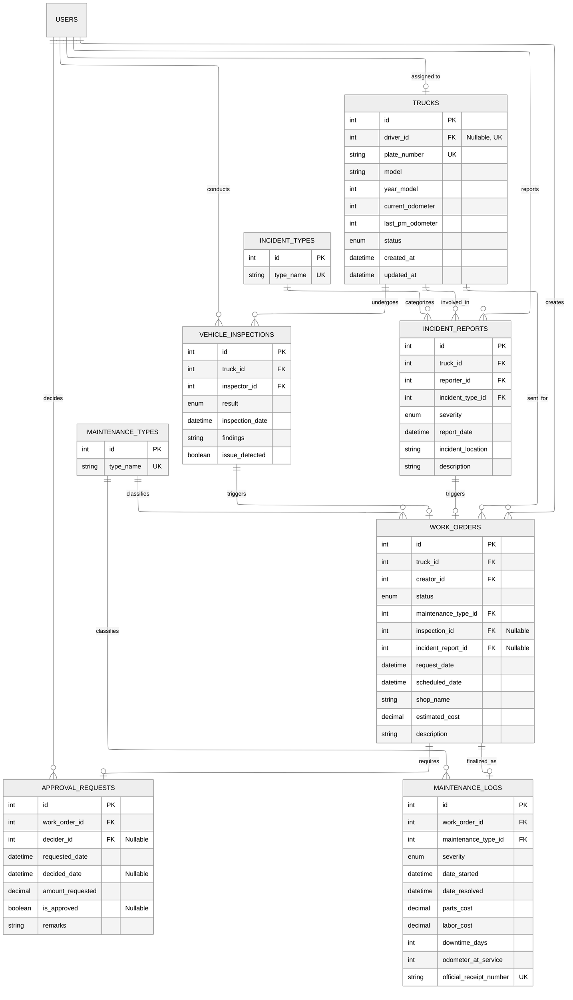

```mermaid
---
config:
  layout: elk
  theme: neutral
---

erDiagram

    %% ==========================================
    %% ENUMS
    %% ==========================================

    %% PostgreSQL ENUMS:
    %%   truck_status:
    %%     ACTIVE, INACTIVE, UNDER_MAINTENANCE, RETIRED

    %%   maintenance_severity:
    %%     LOW, MEDIUM, HIGH, CRITICAL

    %%   work_order_status:
    %%     PENDING, APPROVED, SCHEDULED, IN_PROGRESS, COMPLETED, CANCELLED

    %%   inspection_result:
    %%     PASSED, FAILED, NEEDS_ATTENTION


    %% ==========================================
    %% LOOKUP / DOMAIN TABLES
    %% ==========================================

    MAINTENANCE_TYPES {
        int id PK
        string type_name UK
    }

    INCIDENT_TYPES {
        int id PK
        string type_name UK
    }


    %% ==========================================
    %% CORE ENTITIES
    %% ==========================================

    USERS {
    }

    TRUCKS {
        int id PK
        int driver_id FK "Nullable, UK"
        string plate_number UK
        string model
        int year_model
        int current_odometer
        int last_pm_odometer
        enum status
        datetime created_at
        datetime updated_at
    }

    VEHICLE_INSPECTIONS {
        int id PK
        int truck_id FK
        int inspector_id FK
        enum result
        datetime inspection_date
        string findings
        boolean issue_detected
    }

    INCIDENT_REPORTS {
        int id PK
        int truck_id FK
        int reporter_id FK
        int incident_type_id FK
        enum severity
        datetime report_date
        string incident_location
        string description
    }

    WORK_ORDERS {
        int id PK
        int truck_id FK
        int creator_id FK
        enum status
        int maintenance_type_id FK
        int inspection_id FK "Nullable"
        int incident_report_id FK "Nullable"
        datetime request_date
        datetime scheduled_date
        string shop_name
        decimal estimated_cost
        string description
    }

    APPROVAL_REQUESTS {
        int id PK
        int work_order_id FK
        int decider_id FK "Nullable"
        datetime requested_date
        datetime decided_date "Nullable"
        decimal amount_requested
        boolean is_approved "Nullable"
        string remarks
    }

    MAINTENANCE_LOGS {
        int id PK
        int work_order_id FK
        int maintenance_type_id FK
        enum severity
        datetime date_started
        datetime date_resolved
        decimal parts_cost
        decimal labor_cost
        int downtime_days
        int odometer_at_service
        string official_receipt_number UK
    }


    %% ==========================================
    %% RELATIONSHIPS
    %% ==========================================

    %% Current driver assignment
    USERS ||--o| TRUCKS : "assigned to"

    %% Lookup / classification relationships
    MAINTENANCE_TYPES ||--o{ WORK_ORDERS : "classifies"
    MAINTENANCE_TYPES ||--o{ MAINTENANCE_LOGS : "classifies"
    INCIDENT_TYPES ||--o{ INCIDENT_REPORTS : "categorizes"

    %% User actions
    USERS ||--o{ VEHICLE_INSPECTIONS : "conducts"
    USERS ||--o{ INCIDENT_REPORTS : "reports"
    USERS ||--o{ WORK_ORDERS : "creates"
    USERS ||--o{ APPROVAL_REQUESTS : "decides"

    %% Truck relationships
    TRUCKS ||--o{ VEHICLE_INSPECTIONS : "undergoes"
    TRUCKS ||--o{ INCIDENT_REPORTS : "involved_in"
    TRUCKS ||--o{ WORK_ORDERS : "sent_for"

    %% Maintenance workflow
    VEHICLE_INSPECTIONS ||--o| WORK_ORDERS : "triggers"
    INCIDENT_REPORTS ||--o| WORK_ORDERS : "triggers"
    WORK_ORDERS ||--o| APPROVAL_REQUESTS : "requires"
    WORK_ORDERS ||--o| MAINTENANCE_LOGS : "finalized_as"
```
