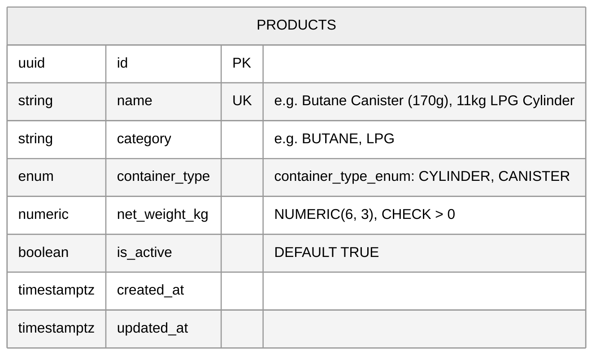

# Inventory Subsystem — Entity Relationship Diagram (ERD)

> **Module**: Inventory Subsystem  
> **Target Database**: PostgreSQL 18.x  
> **Key Architecture Decisions**:
> - **Product Profile Catalog**: Products are classified by strict container categories (`container_type_enum`: `CYLINDER`, `CANISTER`) with decimal net weight (`NUMERIC(6, 3)`).
> - **Canonical Packaging Reference**: `products.id` serves as the foreign key target for trip stock manifests (`trip_load_items.product_id`).
> - **Soft-Deactivation**: Managed via `is_active` flag, guarded with password confirmation.

---

## 1. Mermaid Entity-Relationship Diagram

---

## 2. Table Specifications

### `products`
Master catalog items representing physical LPG cylinders, canisters, and distribution products.

| Column | Data Type | Nullable | Default / Constraints | Description |
| :--- | :--- | :--- | :--- | :--- |
| `id` | `UUID` | No | `PRIMARY KEY DEFAULT gen_random_uuid()` | Product unique identifier |
| `name` | `VARCHAR(255)` | No | `UNIQUE` | Distinct product name (e.g. `11kg LPG Cylinder`) |
| `category` | `VARCHAR(100)` | No | Non-empty | Product family (e.g. `LPG`, `BUTANE`) |
| `container_type` | `container_type_enum` | No | `'CYLINDER'` or `'CANISTER'` | Packaging category |
| `net_weight_kg` | `NUMERIC(6, 3)` | No | `CHECK (net_weight_kg > 0)` | Net LPG gas weight in kilograms (e.g. `11.000`, `0.170`) |
| `is_active` | `BOOLEAN` | No | `DEFAULT TRUE` | Soft-deactivation indicator |
| `created_at` | `TIMESTAMPTZ` | No | `DEFAULT NOW()` | Record creation timestamp |
| `updated_at` | `TIMESTAMPTZ` | No | `DEFAULT NOW()` | Managed automatically via trigger |

---

## 3. Triggers & Automation

- **`trigger_update_products_updated_at`**: `BEFORE UPDATE` trigger on `products` executing `update_products_updated_at_column()` to automatically maintain the `updated_at` timestamp.
