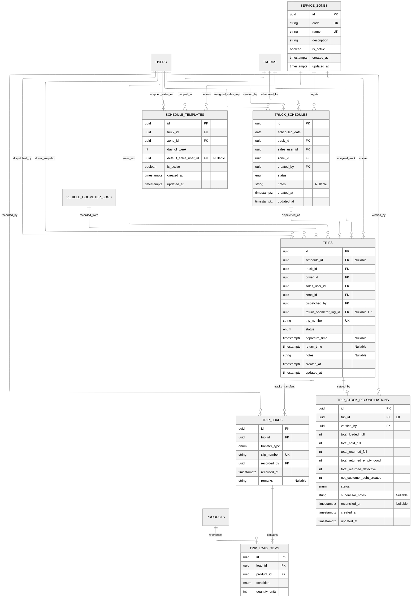

```mermaid
---
config:
  layout: elk
  theme: neutral
---

erDiagram

    %% ==========================================
    %% ENUMS
    %% ==========================================
    %% schedule_status: SCHEDULED, DISPATCHED, CANCELLED
    %% trip_status: PENDING, IN_PROGRESS, COMPLETED, CANCELLED
    %% transfer_type: DISPATCH_LOAD, RETURN_UNLOAD
    %% stock_condition: FILLED, EMPTY_GOOD, DEFECTIVE
    %% reconciliation_status: AWAITING_SYNC, SETTLED, FLAGGED_VARIANCE


    %% ==========================================
    %% EXTERNAL SUBSYSTEM BOUNDARY STUBS
    %% ==========================================

    USERS {
    }

    TRUCKS {
    }

    PRODUCTS {
    }

    VEHICLE_ODOMETER_LOGS {
    }


    %% ==========================================
    %% SCHEDULE & TRIP SUBSYSTEM (3NF)
    %% ==========================================

    SERVICE_ZONES {
        uuid id PK
        string code UK
        string name UK
        string description
        boolean is_active
        timestamptz created_at
        timestamptz updated_at
    }

    SCHEDULE_TEMPLATES {
        uuid id PK
        uuid truck_id FK
        uuid zone_id FK
        int day_of_week
        uuid default_sales_user_id FK "Nullable"
        boolean is_active
        timestamptz created_at
        timestamptz updated_at
    }

    TRUCK_SCHEDULES {
        uuid id PK
        date scheduled_date
        uuid truck_id FK
        uuid sales_user_id FK
        uuid zone_id FK
        uuid created_by FK
        enum status
        string notes "Nullable"
        timestamptz created_at
        timestamptz updated_at
    }

    TRIPS {
        uuid id PK
        uuid schedule_id FK "Nullable"
        uuid truck_id FK
        uuid driver_id FK
        uuid sales_user_id FK
        uuid zone_id FK
        uuid dispatched_by FK
        uuid return_odometer_log_id FK "Nullable, UK"
        string trip_number UK
        enum status
        timestamptz departure_time "Nullable"
        timestamptz return_time "Nullable"
        string notes "Nullable"
        timestamptz created_at
        timestamptz updated_at
    }

    TRIP_LOADS {
        uuid id PK
        uuid trip_id FK
        enum transfer_type
        string slip_number UK
        uuid recorded_by FK
        timestamptz recorded_at
        string remarks "Nullable"
    }

    TRIP_LOAD_ITEMS {
        uuid id PK
        uuid load_id FK
        uuid product_id FK
        enum condition
        int quantity_units
    }

    TRIP_STOCK_RECONCILIATIONS {
        uuid id PK
        uuid trip_id FK "UK"
        uuid verified_by FK
        int total_loaded_full
        int total_sold_full
        int total_returned_full
        int total_returned_empty_good
        int total_returned_defective
        int net_customer_debt_created
        enum status
        string supervisor_notes "Nullable"
        timestamptz reconciled_at "Nullable"
        timestamptz created_at
        timestamptz updated_at
    }


    %% ==========================================
    %% RELATIONSHIPS
    %% ==========================================

    %% User associations
    USERS ||--o{ SCHEDULE_TEMPLATES : "mapped_sales_rep"
    USERS ||--o{ TRUCK_SCHEDULES : "assigned_sales_rep"
    USERS ||--o{ TRUCK_SCHEDULES : "created_by"
    USERS ||--o{ TRIPS : "dispatched_by"
    USERS ||--o{ TRIPS : "driver_snapshot"
    USERS ||--o{ TRIPS : "sales_rep"
    USERS ||--o{ TRIP_LOADS : "recorded_by"
    USERS ||--o{ TRIP_STOCK_RECONCILIATIONS : "verified_by"

    %% Truck associations
    TRUCKS ||--o{ SCHEDULE_TEMPLATES : "mapped_in"
    TRUCKS ||--o{ TRUCK_SCHEDULES : "scheduled_for"
    TRUCKS ||--o{ TRIPS : "assigned_truck"

    %% Service zone routing
    SERVICE_ZONES ||--o{ SCHEDULE_TEMPLATES : "defines"
    SERVICE_ZONES ||--o{ TRUCK_SCHEDULES : "targets"
    SERVICE_ZONES ||--o{ TRIPS : "covers"

    %% Schedule execution
    TRUCK_SCHEDULES |o--o| TRIPS : "dispatched_as"

    %% Inventory movement ledger
    TRIPS ||--o{ TRIP_LOADS : "tracks_transfers"
    TRIP_LOADS ||--|{ TRIP_LOAD_ITEMS : "contains"
    PRODUCTS ||--o{ TRIP_LOAD_ITEMS : "references"

    %% Post-trip reconciliation settlement
    TRIPS ||--o| TRIP_STOCK_RECONCILIATIONS : "settled_by"

    %% Fleet maintenance odometer integration
    VEHICLE_ODOMETER_LOGS ||--o| TRIPS : "recorded_from"
```